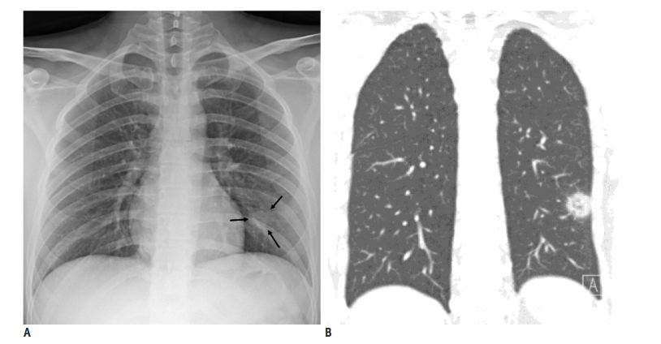
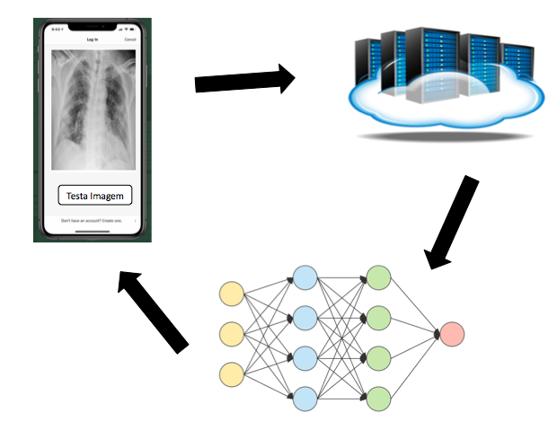
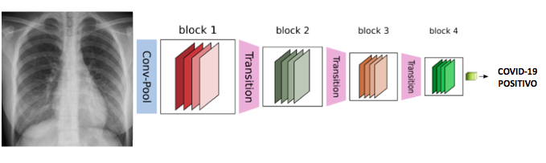

# Projeto COVID-19

### Baseado no trabalho "Towards an Efficient Deep Learning Model for COVID-19 Patterns Detection in X-ray Images", disponível em [link](https://arxiv.org/pdf/2004.05717.pdf).

Em 2020 o mundo foi acometido pela pandemia do COVID-19. A taxa de transmissão do vírus causador da doença é altíssima, e para conter o espalhamento de maneira eficaz, deve-se realizar uma identificação rápida e precisa dos indivíduos invefctados. Hoje uma das formas de diagnóstico é por meio de reação em cadeia da polimerase (PCR), todavia, outras abordagens vêm surgindo, como, por exemplo, a detecção do corona vírus em raios-x do tórax e tomografias computadorizadas (CT).

A detecção por meio do raio-x só é possível dada as anormalidades presentes nas imagens [1]. Segundo os autores, os pacientes com COVID-19 na UTI apresentaram alterações no envolvimento bilateral, áreas lobulares e subsegmentares bilaterais múltiplas. Já os pacientes que não estava na UTI apresentaram alterações na opacidade bilateral e áreas subsegmentares nos exames de tomografia computadorizadas. Outros autores já demonstraram a possibilidade do diagnóstico usando imagens de raio-x [2 e 3].

	
	 
	<em>Exemplo de radiografia do peito de um paciente com COVID-19 (A) e um exemplo de CT do mesmo caso (B). Pode-se percebr a manifestação da pneumonia em como um nódulo. Fonte: Yoon et al. (2020) [14] </em>

## Motivação

Uma das grandes desvantagens apresentadas pelos exames PCR é a sua produção e distribuição em massa. Já as máquinas de raio-x estão presentes na maioria dos hospitais e clínicas, o que torna viável o seu uso. Além disso, o exame PCR apresenta alta taxa de falsos negativos [3]. Por esse motivo, técnicas computacionais de inteligência artificial poedm auxiliar na prevenção e combate ao COVID-19. Algumas empresas já começaram a implementar técnicas de inteligência artificial e de deploying em hospitais [4].

## Objetivos
O principal objetivo deste projeto é propor/desenvolver um modelo de inteligência artificial - especialmente focado em Deep Learning - capaz de detectar COVID-19 em raios-x do tórax. Ele deve ser genérico ao ponto que funcione com diferentes imagens de raio-x de diferentes equipamentos (cross-sensor invariant). Outro objetivo é a implementação do modelo de rede naural em sistema de baixo poder computacional, por exemplo, smartphones e sistemas embarcados (edge computing).

## Solução Proposta

A proposta deste projeto envolve a confecção de uma aplicação que recebe como entrada a foto de um raio-x do tórax e retorna se o indivíduo está infectado pelo vírus SARS-CoV-2, ou seja, automatiza o diagnóstico da COVID-19 por meio de radiografia, visto que existem alterações consistentes nas imagens de raio-X em indivíduos infectados [5]. A proposta envolve a criação de um sistema computacional, dividido em três módulos desacoplados: backend, website e sistema mobile. Os três módulos compõem a arquitetura do sistema em que o website e o sistema mobile são as interfaces do usuário com o sistema, e, por eles, o usuário pode fornecer a imagem - seja por um app (mobile) ou um site (website) - e receber uma resposta de diagnóstico: infectado pelo COVID-19 ou não. Essas duas interfaces comunicam com um sistema backend responsável por processar as imagens usando técnicas de Inteligência Artificial, em especial Deep Learning. A proposta visa a construção de um ambiente com load balance, em que cada requisição nova é direcionada para uma instância do backend com menos sobrecarga, garantindo alta escalabilidade.

	
	 
	<em>Módulos do sistema. </em>

O grande desafio técnico é a construção de um modelo de inteligência artificial profundo (Deep Learning), eficiente e com baixo custo computacional para a inferência (dada uma imagem de entrada, o modelo retorna uma resposta com baixa latência e alta precisão). Deep Learning é uma das técnicas mais proeminentes no cenário de aprendizagem de máquina e hoje em dia representa o estado-da-arte para diversas tarefas de visão computacional [6]. Baseado nisso, propomos o uso de uma rede convolucional residual [7, 8], otimizada para rodar em celulares a tablets. A princípio, usaremos uma base de dados construída pelo Dr. Joseph Cohen [9] com ajuda da comunidade médica mundial. Esta base é pública e já conta com várias imagens de casos reais de COVID-19, possibilitando o treinamento de modelos de deep learning.  Contudo, acreditamos que a base de dados deve aumentar com frequência diária e assim, propomos um método de treinamento (aprendizagem) on-line para manter o modelo sempre atualizado. A construção dessa abordagem já foi iniciada e se encontra em estágio avançado. Temos até o momento um modelo que apresenta uma taxa de detecção superior a 90% dos casos de COVID-19 para a base supracitada, e uma precisão (casos classificados como COVID-19 corretamente) superior a 90%. Para mais detalhes da metodologia, acesse [link](https://arxiv.org/pdf/2004.05717.pdf).

	
	 
	<em> Modelo baseado DenseNet de 4 blocos. </em>

A equipe conta com três pesquisadores, um doutor em Ciência da Computação, um Doutor em Engenharia Elétrica e um Doutorando em Ciência da Computação, todos com expertise em Deep Learning, Visão Computacional e Imagens/Sinais Médicos comprovadas por publicações científicas em grandes veículos acadêmicos internacionais [10, 11, 12 e 13]. 

O sistema está sendo desenhado para médicos diretamente envolvidos com a pandemia de COVID-19 no Brasil e no exterior. Além de servir como um auxílio para detecção de COVID-19 durante a pandemia, a aplicação poderá ser utilizada posteriormente para acompanhamento de sequelas pulmonares em indivíduos acometidos pela doença.

### Base de dados

A base de dados para imagens de COVID é a COVID-19 image data collection, descrita em [9]. Ela está sendo atualizada em base diária. Além dela, seguiremos o protocolo proposto em [15], em que a base proposta em [9] é combinada com uma base de pneumonia:

* https://www.kaggle.com/c/rsna-pneumonia-detection-challenge

Dessa forma, a base de dados contém imagens distribuidas como na Tabela abaixo.

|  Type | Normal | Pneumonia | COVID-19 | Total |
|:-----:|:------:|:---------:|:--------:|:-----:|
| train |  7966  |    8514   |    66    | 16546 |
|  test |   100  |     100   |    10    |   210 |

Referências

[1] Huang, Chaolin, et al. "Clinical features of patients infected with 2019 novel coronavirus in Wuhan, China." The Lancet 395.10223 (2020): 497-506.

[2] Fang, Yicheng, et al. "Sensitivity of chest CT for COVID-19: comparison to RT-PCR." Radiology (2020): 200432.

[3] Ai, Tao, et al. "Correlation of chest CT and RT-PCR testing in coronavirus disease 2019 (COVID-19) in China: a report of 1014 cases." Radiology (2020): 200642.

[4] Simonite, Tom. "Chinese Hospitals Deploy AI to Help Diagnose Covid-19", Wired.com (2020).

[5] Ng et al. Imaging profile of the COVID-19 infection: Radiologic findings and literature review. Radiology: Cardiothoracic Imaging, 2(1), 2020

[6] Iandola, F., Moskewicz, M., Karayev, S., Girshick, R., Darrell, T., & Keutzer, K. (2014). Densenet: Implementing efficient convnet descriptor pyramids. arXiv preprint arXiv:1404.1869.

[7] Pleiss, G., Chen, D., Huang, G., Li, T., van der Maaten, L., & Weinberger, K. Q. (2017). Memory-efficient implementation of densenets. arXiv preprint arXiv:1707.06990.

[8] Tan, M., & Le, Q. V. (2019). Efficientnet: Rethinking model scaling for convolutional neural networks. arXiv preprint arXiv:1905.11946.

[9] Cohen, J. P., Morrison, P., & Dao, L. (2020). Covid-19 image data collection. arXiv preprint arXiv:2003.11597.

[10] Luz, E. J. D. S., Schwartz, W. R., Cámara-Chávez, G., & Menotti, D. (2016). ECG-based heartbeat classification for arrhythmia detection: A survey. Computer methods and programs in biomedicine, 127, 144-164.

[11] Silva, P., Luz, E., Baeta, R., Pedrini, H., Falcao, A. X., & Menotti, D. (2015, August). An approach to iris contact lens detection based on deep image representations. In 2015 28th SIBGRAPI Conference on Graphics, Patterns and Images (pp. 157-164). IEEE.

[12] Luz, E. J. S., Moreira, G. J., Oliveira, L. S., Schwartz, W. R., & Menotti, D. (2017). Learning deep off-the-person heart biometrics representations. IEEE Transactions on Information Forensics and Security, 13(5), 1258-1270.

[13] Luz, E., Moreira, G., Junior, L. A. Z., & Menotti, D. (2018). Deep periocular representation aiming video surveillance. Pattern Recognition Letters, 114, 2-12.

[14] Yoon, S. H., Lee, K. H., Kim, J. Y., Lee, Y. K., Ko, H., Kim, K. H., ... & Kim, Y. H. (2020). Chest radiographic and CT findings of the 2019 novel coronavirus disease (COVID-19): analysis of nine patients treated in Korea. Korean Journal of Radiology, 21(4), 494-500.

[15] Wang, L., & Wong, A. (2020). COVID-Net: A Tailored Deep Convolutional Neural Network Design for Detection of COVID-19 Cases from Chest Radiography Images. arXiv preprint arXiv:2003.09871.
